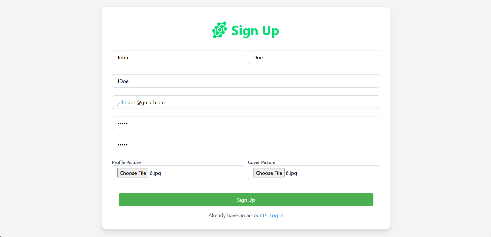
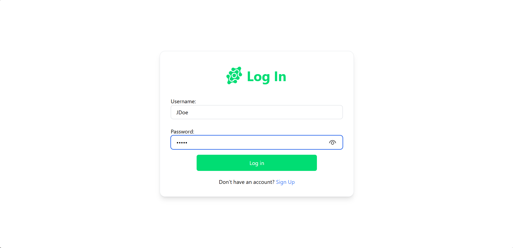
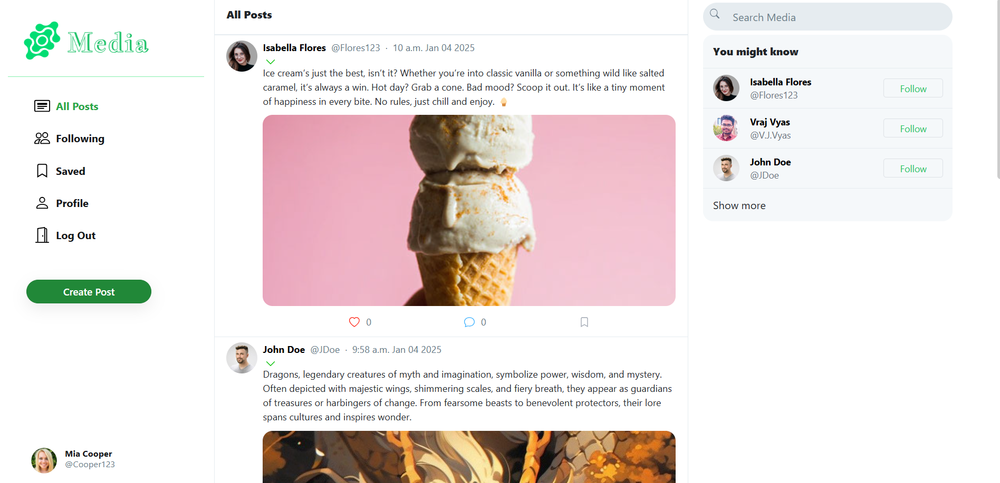
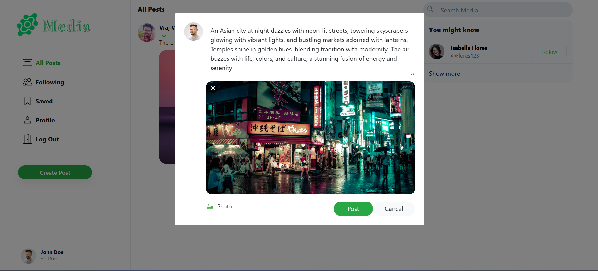
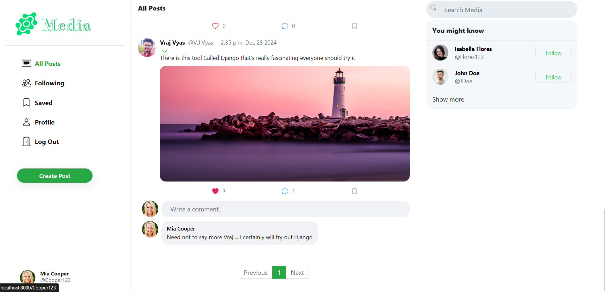
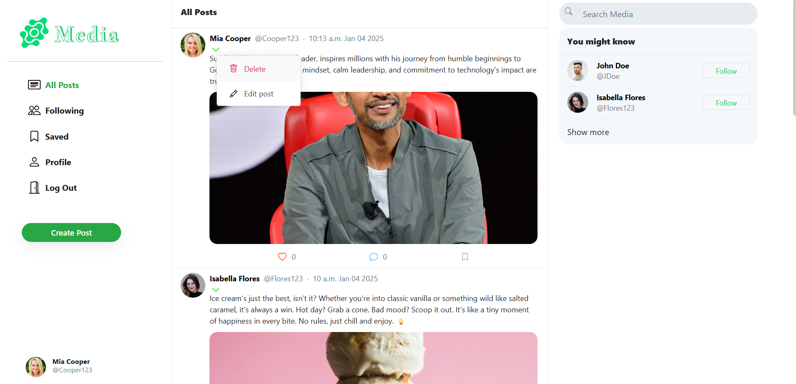
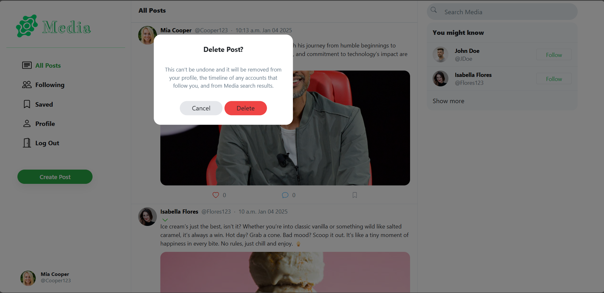
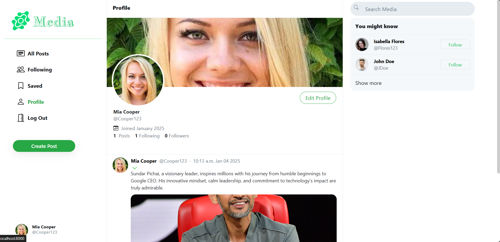
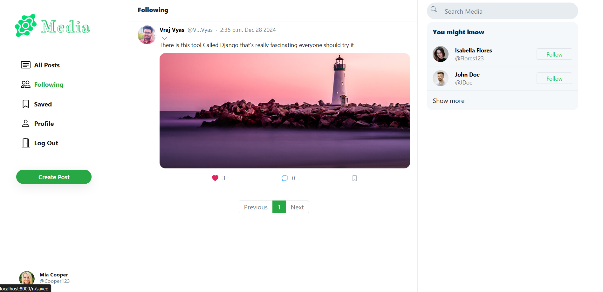
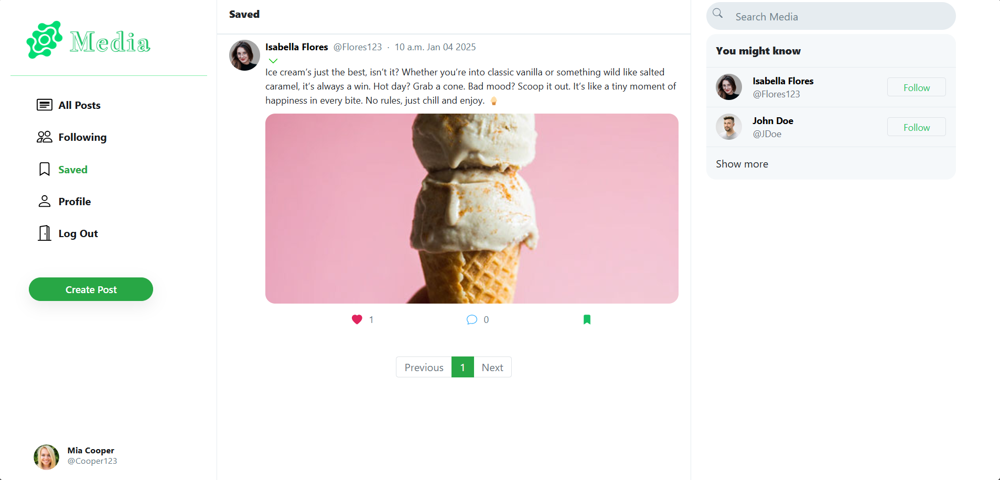

# Django Social Media App

A Django-based social media app that allows users to register, log in, create posts, follow others, like and comment on posts, save posts, search for people, and edit profiles. The app is designed to provide a seamless and interactive experience, making social networking easy and fun.Designed with Plain CSS, Tailwind CSS, and Bootstrap for a responsive and attractive user interface.

## Features

- **Authentication:** Register, login, and log out securely.
- **Posts:** Create, view, edit, and delete posts.
- **Engagement:** Like, comment, and save posts.
- **Social Interactions:** Follow users and explore their updates.
- **Search & Profile:** Find users and customize your profile.

## Live Preview

<table>
  <tr>
    <td></td>
    <td></td>
  </tr>
  <tr>
    <td></td>
    <td></td>
  </tr>
  <tr>
    <td></td>
    <td></td>
  </tr>
  <tr>
    <td></td>
    <td></td>
  </tr>
  <tr>
    <td></td>
    <td></td>
  </tr>
</table>


## Getting Started

Follow these steps to set up the project locally:

1. **Fork the Repository:**
   - Click on the "Fork" button at the top right corner of this repository's GitHub page.

2. **Clone the Repository:**
   ```bash
   git clone https://github.com/VrajVyas11/Django_Social_Media_App.git
   ```

3. **Navigate to the Project Directory:**
   ```bash
   cd Django_Social_Media_App
   ```

4. **Install Dependencies:**
   Ensure you have Python and pip installed, then create a virtual environment and install the required dependencies:
   ```bash
   python -m venv venv
   source venv/bin/activate  # On Windows use venv\Scripts\activate
   pip install -r requirements.txt
   ```

5. **Set Up Environment Variables:**
   Create a `.env` file in the root directory and add the necessary environment variables as specified in `.FakeENV`.

6. **Run Migrations:**
   ```bash
   python manage.py migrate
   ```

7. **Start the Development Server:**
   ```bash
   python manage.py runserver
   ```

8. **Open Your Browser:**
   Navigate to http://localhost:8000 to see the application in action.

## Technologies Used

- **Django**: Python web framework for rapid development.
- **SQLite**: Database for storing user data and posts.
- **HTML, CSS, JavaScript**: Frontend technologies for a responsive user interface.
- **Bootstrap**: For responsive and attractive UI components.

## Contributions

Feel free to fork this repository, create issues, and submit pull requests. Contributions are always welcome!
